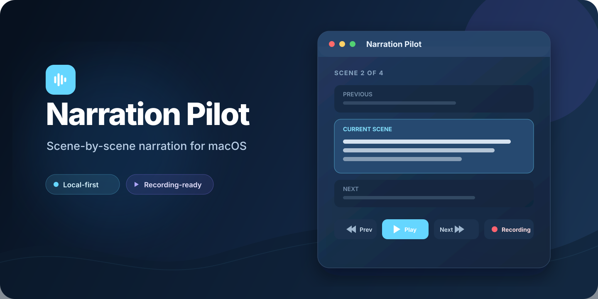

<div align="center">

# Narration Pilot

**A scene-by-scene narration companion for macOS.**

[](https://www.apple.com/macos/)
[](https://www.swift.org/)
[](LICENSE)
[](#privacy)



</div>

Narration Pilot is a native macOS menu bar app for tutorial creators, screen recorders, and anyone who needs reliable text-to-speech while working through a script. Paste or type a script, organize it into scenes, play one scene at a time, and control the entire session with global shortcuts.

## Why Narration Pilot?

Traditional text-to-speech tools read a whole document. Narration Pilot treats a script as a production workflow: the current scene stays in focus, recording directions can remain visible without being narrated, and external shortcuts can start or stop another recording app around speech.

## Features

| Area | What Narration Pilot provides |
| --- | --- |
| **Scene playback** | Automatic sentence splitting, one-scene-at-a-time narration, previous, replay, next, and restart controls |
| **Scene Manager** | Select, edit, split, merge, and delete scenes while preserving manual scene boundaries |
| **Production directions** | Normal playback skips text inside square brackets; Replay Scene includes it |
| **Presenter overlay** | Previous, current, and next scene context with adjustable placement, size, opacity, typography, and colors |
| **Recording-friendly UI** | Presenter overlay and Scene Manager can be hidden from standard macOS screen capture |
| **Global shortcuts** | Two current-input shortcuts and three always-read-clipboard shortcuts, each with its own speech speed |
| **Recording automation** | Verified FocuSee actions, independent delays, optional cue sounds, and Neon Spotlight fade-out waiting |
| **Speech controls** | macOS voices, adjustable rate, pause, resume, stop, and replay |
| **Input choices** | Read the clipboard, entered text, or a scene-based script |
| **Privacy** | Local-first operation with no analytics, accounts, advertising, or project-owned cloud storage |

## How it works

1. Paste a tutorial script or enter text directly.
2. Turn on **Script mode** to create sentence-based scenes.
3. Use **Play Scene** or a global shortcut to narrate the current scene.
4. Narration Pilot advances to the next scene when speech finishes.

For example:

```text
[On screen: Open the image overlay window.] Yesterday, I wanted to add a new option here.
```

Normal playback reads only the narration. **Replay Scene** reads the complete scene, including the bracketed direction.

## Requirements

- macOS 15 or newer
- Apple Silicon Mac—the currently tested architecture
- Xcode and the Xcode Command Line Tools when building from source

## Quick start

Clone and build the project:

```bash
git clone https://github.com/sahandghavidel/narration-pilot.git
cd narration-pilot
swift build
```

Run the newest debug build:

```bash
./scripts/dev-run.sh
```

Run an optimized release build without installing an app bundle:

```bash
./scripts/build-app.sh release
```

The signed test bundle is created at
`.build/app/release/Narration Pilot.app`. Use `dev-release-run.sh` only when you
want to run the raw SwiftPM executable instead of an application bundle.

## Install the macOS app locally

```bash
./scripts/install-local-app.sh
```

This installs `Narration Pilot.app` in `~/Applications` and launches it. Upgrades retain the legacy `local.clipboardreadermac` bundle identifier so people upgrading from Clipboard Reader keep their shortcuts and settings.

> [!NOTE]
> The raw SwiftPM executable and the installed app use different macOS preferences domains. Use the installed app for normal work when you want one stable set of shortcuts and settings.

## Using Narration Pilot

### Reading modes

- Leave **Read typed text instead of clipboard** off to read the current clipboard.
- Turn it on to read text entered in the app.
- Turn on **Script mode** to split a tutorial script into scenes and play one scene at a time.

### Scene workflow

Use **Previous**, **Replay**, **Next**, and **Restart** to navigate. Open **Edit Current Scene** to select, edit, split, merge, or delete scenes. Manual boundaries remain in place until the raw script is changed directly.

### Presenter overlay

The overlay shows the previous, current, and next scenes. It supports custom sizing, placement, opacity, typography, colors, and quick color presets. You can hide it from standard macOS screen capture or hide it automatically while speech is playing.

### Shortcuts and recording triggers

Narration Pilot provides two shortcuts for reading the current input and three shortcuts that always read the clipboard. Every read shortcut can use a different speed and choose an external action before and after speech: do nothing, toggle the configured shortcut, ensure FocuSee is recording, or ensure FocuSee is paused. Each action can use an independent 0–10 second delay so recording can settle before speech begins and continue briefly after speech ends. Existing trigger settings migrate to the original toggle behavior.

When **Ensure FocuSee is paused** is selected after reading, that shortcut can
optionally wait for Neon Spotlight. Narration Pilot checks Neon Spotlight's
local animation status after the normal post-speech delay and pauses FocuSee
only after every visible highlight and fade-out completes. The option defaults
off. If Neon Spotlight is closed, does not respond, quits, or remains busy for
more than 10 seconds, Narration Pilot safely continues with the verified pause.

The FocuSee actions inspect its macOS Accessibility controls before sending its existing Pause/Continue Recording shortcut. Separate global shortcuts can also be assigned for **Ensure FocuSee Recording** and **Ensure FocuSee Paused**. If FocuSee is closed, stopped, or its state cannot be determined safely, Narration Pilot does not send the toggle.

Optional recording cue sounds can play before FocuSee starts and after FocuSee is verified as paused. Start and stop cue timing is adjustable, and a separately selectable failure sound plays if a verified action fails. Narration is cancelled when FocuSee cannot be confirmed as recording.

The **Fix Latest FocuSee Zooms to 3 Seconds** project tool updates only generated zooms shorter than three seconds in the newest saved FocuSee project. Apply the default FocuSee preset and save the project first; Narration Pilot preserves the other project settings and creates a configuration backup before changing zoom tracks.

Sending external shortcuts requires macOS Accessibility permission. Narration Pilot requests that permission only when you ask it to.

## VS Code development

Open the repository and choose one of these tasks from **Terminal → Run Task**:

- **Dev Run Narration Pilot**
- **Dev Release Run Narration Pilot**

The Run and Debug panel also includes debug and release configurations for the `NarrationPilot` executable.

## Testing

```bash
swift build
swift build -c release
swift test
```

Some standalone Swift toolchains do not provide XCTest. In that environment the executable builds still work, but `swift test` reports `no such module 'XCTest'`.

## Privacy

Narration Pilot is local-first. Script text is passed to macOS speech services and is not uploaded by this project. The app contains no analytics, accounts, advertising, or remote storage.

## Contributing

Contributions are welcome. Please read [CONTRIBUTING.md](CONTRIBUTING.md) before opening a pull request.

## License

Narration Pilot is open source under the [MIT License](LICENSE).
